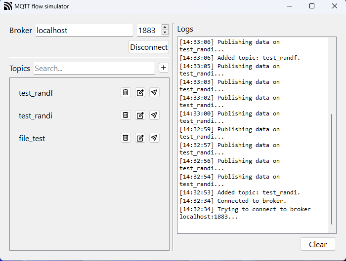
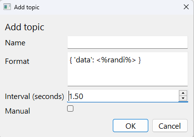

## Setup
After cloning the repo, before running the app you need to install required packages. I recommend using virtual environment (venv) for this:

- First create the virtual environment:
  ```
  python3 -m venv <your-venv-name>
  ```

- Then you need to activate the environment:

    #### MacOS
    ```
    source <your-venv-name>/bin/activate
    ```

    #### Windows
    - using cmd
        ```
        <your-venv-name>/Scripts/activate.bat
        ```

    - using powershell
        ```
        <your-venv-name>/Scripts/Activate.ps1
        ```

- Once environment is activated, install required packages
    ```
    pip install -r requirements.txt
    ```
- Run the app using
    ```
    python3 main.py
    ```
- To quit the app use the exit button in gui (or Ctrl+C in CLI mode)
- To quit virtual environment, type
    ```
    deactivate
    ```

## Arguments
You can run the app with several arguments described below:

| command       | shortened | arguments                                                             | example                                      | description                                         |
| ------------- | --------- | --------------------------------------------------------------------- | -------------------------------------------- | --------------------------------------------------- |
| `--set-broker` | `-sb`      | host (string), port (int)                                                         | python main.py -sb localhost 1883            | sets current broker                                 |
| `--add-topic`  | `-at`      | topic name (string), data format (string), interval [seconds] (float) | python main.py -at "my/topic" "<%randi%>" 10 | adds topic to list                                  |
| `--no-gui`     | `-nogui`   | \-                                                                    | python main.py -nogui                        | launches app without gui                            |
| `--verbose`    | `-v`      | \-                                                                    | python main.py -v                            | prints logs to console in addition to logs.txt file |

## Data format
Data format is a string containg formula for a message. Additionally, data format functions can accept arguments. Here is table with each function and argument described

| function | accepted arguments                         | default                   | example data format                     | description                                                                                                                                          |
| -------- | ------------------------------------------ | ------------------------- | --------------------------------------- | ---------------------------------------------------------------------------------------------------------------------------------------------------- |
| `randi`   | `min` (int), `max` (int)                       | min = -2^31, max = 2^31-1 | <%randi min=-10 max=10%>                | Sends random int from [`min`; `max`] range                                                                                                               |
| `randu`    | `min` (int), `max` (int)                       | min = 0, max = 2^32 - 1   | <%randu min=10 max=20%>                 | Sends random uint from [`min`; `max`] range                                                                                                              |
| `randf`    | `min` (float), `max` (float)                   | min = 0, max = 1          | <%randf min=-1 max=16.9%>               | Sends random float from [`min`; `max`) range                                                                                                             |
| `rands`    | `collection` (list of strings), `length` (int) | length = 10               | <%rands collection=["a","ab",'abc']%> | Sends random string from given `collection` or generates random string with given `length`. If both arguments are passed, it will prioritize collection. |
| `file`     | `src` (string), `separator` (string)           | separator = "None"           | <%file src="test.txt" separator="\\n"%> | Sends data from given file one, split by given `separator` (or all of it at once if separator is not specified)                                                                                                                      |
| `time`    | -               | -       | <%time%>               | Sends current time (datetime.now().time()) 
| `datetime`    | -               | -       | <%datetime%>               | Sends current date time in ISO format (datetime.now().isoformat()) 
| `inc`    | `start` (int \| float), `inc` (int \| float), `reset` (int \| float)               | start = 0, inc = 1, reset = None       | <%inc start=0 inc=2 reset=10%>               | Every time the message is sent, the value is incremented by `inc`. When the value is more than `reset` it returns back to `start`.

Keep in mind that <b>you dont always have to pass in all the arguments</b>. If you skip any (for example max in ```randi```, it will use the default value).

Argument value cannot contain space characters unless it's a string or a list (starts with `'`, `"` or `[`). For example: 
- ```<%rands collection=["x", "y"]%>``` - OK (collection value uses `[` ... `]`)
- ```<%rands collection= ["x", "y"]%>``` - ERROR (space before opening square bracket)
- ```<%file src="hello world.txt"%>``` - OK (src value uses `"` ... `"`)
- ```<%randi max= 10%>``` - ERROR (space after parameter value)

### Example
Assume we want to revieve messages with following format

```json
{
    "data": {
        "x": <some int>,
        "y": <some float>,
    }
}
```

Our <b>Data format</b> would then be
```json
{ "data": { "x": "<%randi%>", "y": "<%randf%>" } }
```

### Manual setup of config file
You can always create ```config.json``` file yourself if you think writing it with the command line tool is too tedious - simply follow the format below (uuid is treated as ```str``` not uuid type, so you can use whatever unique string you want).
```json
{
    "broker": { 
        "host": "localhost",
        "port": 1883
    },
    "topics": {
        "5b8cf095-c3c6-4730-8618-80811f4506ab": {
            "topic": "topic1"
            "data_format": "<%randi%>",
            "interval": 1,
            "manual": false
        },
        "my-app-unique-id": {
            "topic": "test/topic2",
            "data_format": "{ \"x\": \"<%randu%>\" }",
            "interval": 1.5,
            "manual": false
        }
    }
}
```
> result - app publishes random int value on 'topic1' every second and random uint value on 'test/topic2'

## Screenshots
Keep in mind that the look of the app is dependent on user's system - QT uses native components.
<p align="center">
  
  <br>
Main window
</p>

<p align="center">
  
  <br>
Add topic window
</p>
